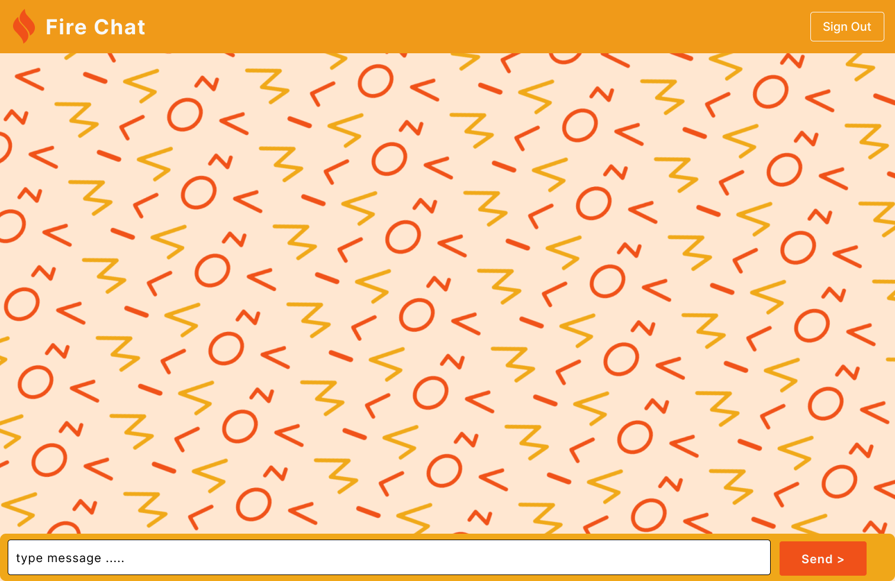

# FireChat

## Project Description
FireChat is a group chatting web application designed to facilitate real-time communication among all users at a single page. Built using ReactJS and Firebase, FireChat offers seamless integration with Google Authentication for easy sign-in. This project aims to provide users with a convenient platform for connecting and conversing with friends, family, or colleagues in a secure and efficient manner.

## Tools Used
- ReactJS
- Firebase
- Google Authentication

## Screenshots

## Live Figma Design
[View FireChat Figma Design](https://www.figma.com/file/cBRJL6MDo6YWlpot240xmN/Untitled?type=design&node-id=0-1&mode=design&t=8qzI2zbiddEvgrpM-0)

## Installation
To run FireChat locally, follow these steps:

1. Clone this repository.
2. Navigate to the project directory.
3. Install dependencies using `npm install`.
4. Configure Firebase for your project and add your Firebase configuration details.
5. Run the app using `npm start`.

## Usage
- Sign in using your Google account.
- Start chatting with other users in real-time.

## Contributing
Contributions are welcome! Please feel free to fork this repository and submit pull requests to suggest improvements or fix issues.

